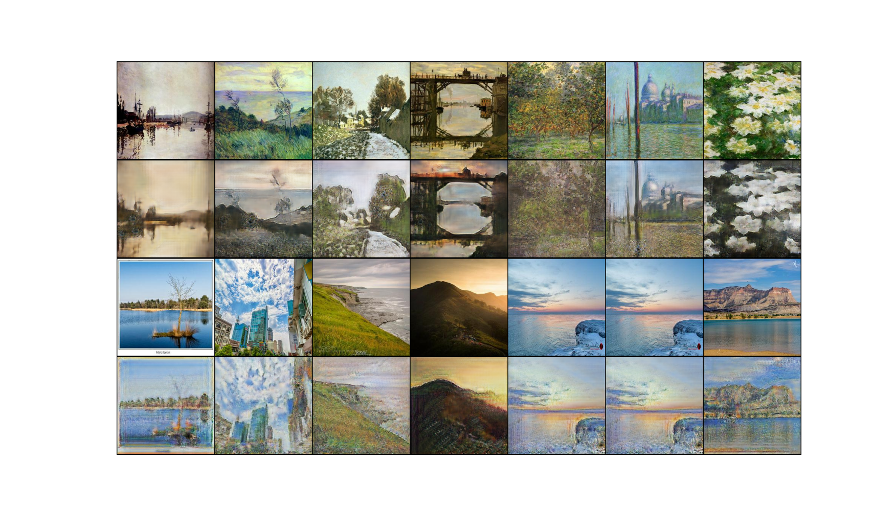

# CycleGAN Style Transfer: Photo to Monet

> **11th Place Solution** for the Kaggle competition "I'm Something of a Painter Myself"



This project implements a CycleGAN-based solution to transform conventional photographs into paintings that emulate Claude Monet's distinctive impressionist style. The system was developed for the Kaggle challenge ["I'm Something of a Painter Myself"](https://www.kaggle.com/competitions/gan-getting-started) and achieved **11th place**.

This repository contains the code for the final project of the course [Deep Generative Neural Networks: Fundamentals and Problem Solving](https://eva.fing.edu.uy/course/view.php?id=1381) at the [Facultad de Ingeniería](https://www.fing.edu.uy/) of the [Universidad de la República](https://udelar.edu.uy/portal/).

## Overview

The implemented CycleGAN architecture enables style transfer without requiring paired images (photograph-painting), making it possible to learn transformations between two domains using only unpaired examples from each domain. Key features:

- **Generators** based on ResNet with residual blocks to maintain structure while transferring style
- **Discriminators** using PatchGAN that classify whether portions of an image are real or generated
- **Bidirectional training** (photo→painting and painting→photo) to improve transformation consistency
- **MiFID metrics** for quantitative performance evaluation

## Environment Setup

### Clone the repository

```bash
git clone https://github.com/juanpablosotelo/cyclegan-style-transfer.git
```

```bash
cd cyclegan-style-transfer
```

### Installing uv

This project uses [uv](https://github.com/astral-sh/uv) for dependency and virtual environment management, offering faster and more efficient package installation and management than traditional tools.

If you don't have uv installed yet, you can install it with:

```bash
curl -LsSf https://astral.sh/uv/install.sh | sh
```

Or with pip:

```bash
pip install uv
```

### Virtual Environment Setup

To create a virtual environment and install dependencies:

```bash
# Create a virtual environment
uv venv
source .venv/bin/activate  # On Linux/macOS

# Install all project dependencies using uv sync
uv sync

# Alternatively, for development with additional tools:
uv sync --dev
```

## Usage

### Local Training

To train the model locally:

```bash
# Using the train script defined in pyproject.toml
train --config configs/local.yaml

# Or directly with the module
python -m src.train --config configs/local.yaml
```

### Prediction

To generate images with a trained model:

```bash
# Using the predict script defined in pyproject.toml
predict --config configs/local.yaml

# Or directly with the module
python -m src.predict --config configs/local.yaml
```

### Kaggle Training and Prediction

This project is optimized to run in Kaggle environments with GPUs. To train on Kaggle:

1. Create a Kaggle notebook
2. Clone this repository into the notebook
3. Install the dependencies with uv
4. Run !cd cyclegan-style-transfer
5. Use the provided Kaggle configuration:
   ```python
   !python -m src.train --config configs/kaggle.yaml
   ```
6. Run the prediction script
   ```python
   !python -m src.predict --config configs/kaggle.yaml
   ```

El archivo [`cyclegan-style-transfer.ipynb`](cyclegan-style-transfer.ipynb) contiene el código para entrenar y predecir en Kaggle.

## Project Structure

```
.
├── configs/               # YAML configuration files
├── data/                  # Training and validation data
├── results/               # Training results and predictions
├── src/                   # Source code
│   ├── models/            # Models (Generator, Discriminator)
│   ├── config.py          # Configuration management
│   ├── dataset.py         # Data loading and preprocessing
│   ├── metrics.py         # Evaluation metrics
│   ├── predict.py         # Prediction generation
│   ├── train.py           # Training script
│   ├── trainer.py         # Training process logic
│   └── utils.py           # General utilities
└── pyproject.toml         # Project configuration and dependencies
```

## License

This project is licensed under the MIT License. See the [LICENSE](LICENSE) file for details.
